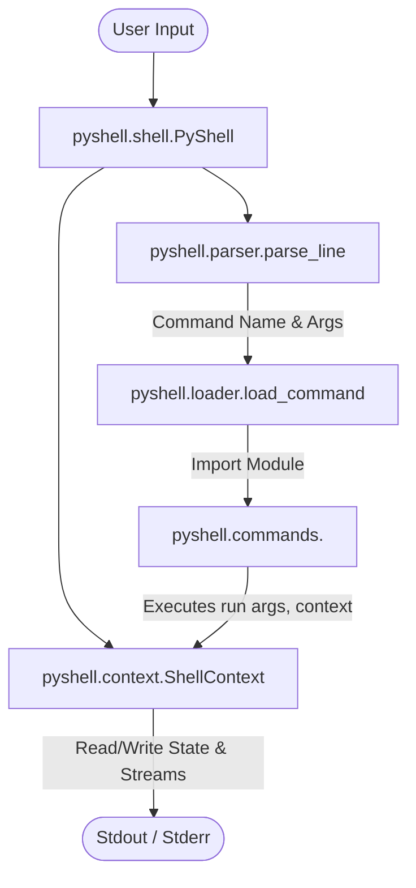

# PyShell - Comprehensive Project Documentation & Technical Summary

This document serves as an exhaustive technical guide for **PyShell**, a modular UNIX-like shell application implemented entirely in Python. It is designed to help team members, reviewers, and evaluators understand the architecture, logic, standard libraries used, command capabilities, and design decisions.

---

## 📌 Executive Summary

**PyShell** is a modular, extensible command-line shell built using Python. 
It follows a **Plugin Architecture Pattern**, where every command is a standalone module loaded dynamically at runtime. 

### Key Principles:
1. **Zero External Processes**: Commands do NOT spawn OS subprocesses or execute system binaries (`ls`, `cp`, `grep`, etc.). All logic is written in Python.
2. **Pure Standard Library**: No 3rd-party dependencies (`pip install ...`). Everything relies on Python standard libraries.
3. **Decoupled Architecture**: Separation of Shell Engine, Line Parser, Dynamic Module Loader, State Context, and Individual Command Modules.

---

## 🛠️ Standard Libraries Deep-Dive (Which Library Does What)

| Python Standard Library | Exact Responsibility & Usage in PyShell |
| :--- | :--- |
| **`shlex`** | **Shell Line Parsing**: `shlex.split(line)` correctly handles quotes and spaces in file paths (e.g. `cat "my file.txt"`) without breaking arguments. |
| **`importlib`** | **Dynamic Command Loading**: `importlib.import_module("pyshell.commands.<cmd>")` dynamically imports command python files at runtime based on user input. |
| **`pathlib` (`Path`)** | **Filesystem Abstraction**: Used across all file/directory operations (`Path.cwd()`, `Path.exists()`, `Path.is_dir()`, `Path.mkdir()`, `Path.rmdir()`, `Path.unlink()`, `Path.stat()`). Replaces fragile string concatenation. |
| **`shutil`** | **File & Directory Management**: High-level operations such as `shutil.copy()`, `shutil.copytree()`, `shutil.move()`, and `shutil.rmtree()` for recursive directory deletion. |
| **`os`** | **Directory Traversal**: Used in `search.py` / `find.py` via `os.walk()` to recursively scan directory trees and handle permission errors. |
| **`re`** | **Regex Search**: Used in `grep.py` for regular expression pattern matching across lines of text. |
| **`readline`** | **Interactive UX**: Configures **Up/Down arrow key command history** (persisted in `~/.pyshell_history`) and **Tab key autocompletion** for command names and file/directory paths. |
| **`datetime`** | **System Date & Time**: Used in `date.py` to format current system timestamp (`datetime.now()`). |
| **`getpass`** | **User Identification**: Used in `whoami.py` (`getpass.getuser()`) to fetch current system user cleanly without subprocesses. |
| **`socket`** | **System Hostname**: Used in `hostname.py` (`socket.gethostname()`) to retrieve network node name. |
| **`time`** | **High-Resolution Performance Timing**: Used in `timeit.py` (`time.perf_counter()`) to measure execution time of nested commands. |
| **`collections.deque`** | **Efficient Buffer**: Used in `tail.py` with a fixed `maxlen` to efficiently read the last $N$ lines of large files without reading everything into memory. |
| **`unittest` / `tempfile` / `io`** | **Automated Testing**: Provides isolated test sandboxes (`tempfile.TemporaryDirectory()`) and output capture streams (`io.StringIO`) for unit testing. |

---

## 🏗️ Architecture & Component Logic

### Component Diagram



### 1. State Management (`pyshell/context.py`)
- `ShellContext` holds the state across command invocations:
  - `current_directory`: A `pathlib.Path` object tracking current working directory.
  - `running`: A boolean flag controlling REPL execution loop.
  - `stdout` / `stderr`: Stream objects for I/O separation (enables clean unit testing without polluting system terminal).

### 2. Line Parser (`pyshell/parser.py`)
- Takes raw input string (e.g. `cp "file 1.txt" "backup dir/"`).
- Uses `shlex.split()` to return `cmd_name` (`cp`) and `args` (`['file 1.txt', 'backup dir/']`).

### 3. Dynamic Module Loader (`pyshell/loader.py`)
- Avoids large `if/elif` statements.
- Given command name `"ls"`, it invokes `importlib.import_module("pyshell.commands.ls")`.
- Validates that the loaded module exports a callable `run(args, context)` function.
- If missing, raises `CommandNotFoundError`.

### 4. Interactive UX Engine (`pyshell/shell.py`)
- Handles REPL loop (`PyShell> ` prompt).
- Configures `readline` completer (`PyShellCompleter`) for:
  1. Auto-completing command names when typing the first word.
  2. Auto-completing matching file and directory paths when typing subsequent arguments.
- Saves history to `~/.pyshell_history` on exit.

---

## ✍️ How to Write Text Inside Files in PyShell

You can create files and write content into them using `touch` and `echo`:

### Method 1: Redirection with `>` (Overwrite) or `>>` (Append)
```text
PyShell> touch mynote.txt
PyShell> echo Hello World > mynote.txt
Written to `mynote.txt`.

PyShell> echo Adding line 2 >> mynote.txt
Written to `mynote.txt`.

PyShell> cat mynote.txt
Hello World
Adding line 2
```

### Method 2: Direct file argument syntax
```text
PyShell> echo "This is file content" mynote.txt
Written to `mynote.txt`.

PyShell> cat mynote.txt
This is file content
```

---

## 📖 Complete Command Inventory (22 Commands)

### Directory Operations
- `pwd`: Prints current working directory.
- `cd <path>`: Changes working directory (supports `..`, `/`, relative/absolute paths).
- `ls [-r|-R] [path]`: Lists contents. `-r` / `-R` performs recursive directory listing.
- `mkdir <dir>`: Creates directory. Displays error if directory already exists.
- `rmdir <dir>`: Removes empty directory. Displays error if directory contains files.

### File Operations
- `touch <file1> [file2 ...]`: Creates empty file(s) or updates timestamp.
- `echo <text> [> file | >> file]`: Prints text or writes/appends text to target file.
- `cat <file>`: Reads and prints full file content.
- `cp <src> <dest>`: Copies file or directory tree (`shutil.copy` / `shutil.copytree`).
- `mv <src> <dest>`: Moves or renames file or directory (`shutil.move`).
- `rm [-r] <target>`: Deletes file (`unlink`) or directory recursively (`shutil.rmtree`).
- `sizeof <file>`: Displays file size in bytes (`Path.stat().st_size`).

### Text Processing & Search
- `grep [-n] <pattern> <file>`: Regex search. `-n` prepends `{file}:{line_number}:`.
- `head [-N] <file>`: Displays first $N$ lines (default 10).
- `tail [-N] <file>`: Displays last $N$ lines using efficient `deque` buffer.
- `search [--in=<dir>] [--file=<pattern>]`: Recursive directory search.
- `find <pattern>`: Alias for `search`.

### System & Shell Control
- `date`: Formatted system date & time.
- `whoami`: Current logged-in user (`getpass.getuser()`).
- `hostname`: Machine network hostname (`socket.gethostname()`).
- `timeit <cmd>`: Times command execution using `time.perf_counter()`.
- `clear`: Clears screen and scrollback buffer using ANSI escape sequence `\033[2J\033[H\033[3J` with immediate stream flush.
- `exit`: Sets `context.running = False` and exits cleanly.

---

## ❓ Evaluator Q&A Cheat Sheet (How to Answer Questions)

**Q1: Why did you use `shlex.split()` instead of standard `.split()`?**
> *Answer*: Standard `str.split()` breaks paths containing spaces (e.g. `cat "My Document.txt"` would be split into `["cat", '"My', 'Document.txt"']`). `shlex.split()` understands shell quoting rules and preserves quoted strings as single arguments.

**Q2: How does the shell load new commands without modifying `main.py`?**
> *Answer*: Through `importlib.import_module()`. When the user types `xyz`, the loader attempts to load `pyshell.commands.xyz`. If `pyshell/commands/xyz.py` exists and exports a `run()` function, it executes immediately. No `if/elif` statements exist in `shell.py`.

**Q3: How is state (like `cd`) preserved between commands?**
> *Answer*: State is maintained inside a shared `ShellContext` object. `cd` modifies `context.current_directory`, which is passed to subsequent commands like `pwd` or `ls`.

**Q4: How do arrow key history and tab completion work?**
> *Answer*: We use Python's built-in `readline` module. We configure `readline.set_completer()` with a custom completer class (`PyShellCompleter`) that inspects input context to complete command names or filesystem paths, and bind history saving to `~/.pyshell_history`.

**Q5: Are external binary programs (`/bin/bash`, `/bin/ls`) called?**
> *Answer*: No. All commands are standard Python functions using standard library modules like `pathlib`, `shutil`, `re`, and `os`.

---

## 🧪 Verification & Running

### Running PyShell:
```bash
python3 main.py
```

### Running Test Suite:
```bash
python3 -m unittest discover -s tests -p "test_*.py"
```
*(25 tests passed)*
