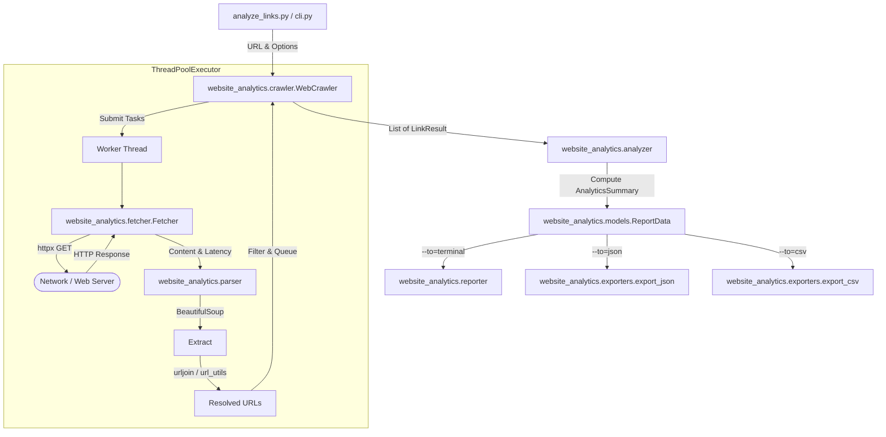

# Project 2: Website Analytics & Link Crawler CLI - Comprehensive Summary & Technical Guide

This document is an exhaustive technical reference for **Project 2: Website Analytics Tool** (`analyze_links.py`). It is created to help team members, evaluators, and reviewers thoroughly understand the project's architecture, logic, libraries, data flow, and implementation details.

---

## 📌 Executive Summary

**Website Analytics Tool** is a command-line application that crawls any given website URL, extracts and categorizes all discovered links, measures response metrics (status code, latency, bytes transferred, content type), identifies broken links, and generates reports in **Terminal ASCII Table**, **JSON**, or **CSV** format.

### Key Highlights:
1. **Multithreaded Concurrent Crawling**: Parallel HTTP fetching powered by `concurrent.futures.ThreadPoolExecutor`.
2. **Library-First Architecture**: Built using industry-standard libraries (`httpx` for HTTP networking, `beautifulsoup4` for HTML parsing, `urllib.parse` for URL resolution).
3. **Zero Browser Automation**: Uses lightweight HTTP requests and HTML parsing instead of heavy browser drivers like Selenium or Playwright.
4. **Bounded Crawl Safety**: Limits crawling to internal links up to a configurable `--max-depth` (default `2`), preventing internet traversal traps. External links are analyzed once without recursive expansion.

---

## 🛠️ Complete Library Inventory & Technical Breakdown

| Library / Module | Source | Exact Responsibility in Project |
| :--- | :--- | :--- |
| **`httpx`** | 3rd-Party | **HTTP Request Client**: Handles HTTP/HTTPS connections with reusable connection pooling, automatic redirect following (`follow_redirects=True`), custom `User-Agent`, and timeout enforcement. |
| **`beautifulsoup4` (`bs4`)** | 3rd-Party | **HTML Link Extraction**: Parses HTML DOM trees using `BeautifulSoup(html, "html.parser")` and extracts `<a href="...">` anchor attributes. |
| **`urllib.parse`** | Standard Library | **URL Processing**: Resolves relative paths (`urljoin`), extracts hostnames/domains (`urlparse`), and cleans fragments/schemes (`urlunparse`). |
| **`concurrent.futures.ThreadPoolExecutor`** | Standard Library | **Concurrency Engine**: Manages a pool of worker threads to fetch multiple URLs in parallel, accelerating network I/O. |
| **`threading.Lock`** | Standard Library | **Thread Synchronization**: Protects shared collections (`visited_urls` set and `results` list) from race conditions during parallel crawls. |
| **`time.perf_counter()`** | Standard Library | **High-Precision Timing**: Measures exact HTTP request-response latency in milliseconds. |
| **`argparse`** | Standard Library | **CLI Parameter Parsing**: Handles positional arguments (`url`) and optional flags (`--to`, `--max-depth`, `--workers`, `--timeout`). |
| **`dataclasses` (`@dataclass`)** | Standard Library | **Data Modeling**: Defines clean, type-hinted data containers (`LinkResult`, `AnalyticsSummary`, `ReportData`). |
| **`json`** | Standard Library | **JSON Export**: Serializes summary statistics and detailed link arrays for `--to=json`. |
| **`csv`** | Standard Library | **CSV Export**: Uses `csv.DictWriter` to format tabular data for `--to=csv`. |
| **`pytest` & `httpx.MockTransport`** | Development | **Deterministic Testing**: Mocks HTTP network requests in test suites without relying on external internet connectivity. |

---

## 📐 System Architecture & Data Flow



---

## 🧠 Logic Building & Core Algorithms

### 1. URL Normalization & Resolution (`url_utils.py`)
- **Fragment Removal**: Anchors like `https://example.com/about#team` are normalized to `https://example.com/about` to avoid duplicate crawling.
- **Safe Joining**: Relative links like `/contact` or `../products` are resolved against the base URL using `urllib.parse.urljoin(base_url, href)`.
- **Scheme Filtering**: Non-web links (`mailto:`, `tel:`, `javascript:`, `#`) are skipped.

### 2. Internal vs. External Classification Policy (`url_utils.py`)
- The base domain is extracted from the starting URL (e.g. `chandrashekar.info`).
- **Internal**: Targets matching `chandrashekar.info` or its subdomains.
- **External**: Distinct external hostnames (e.g. `github.com`, `medium.com`).

### 3. Bounded Level-by-Level Crawling Algorithm (`crawler.py`)
```text
Depth 0: [Starting URL]
  ↓ (Fetch & Extract Links)
Depth 1: [Links found on Starting Page]
  ↓ (Fetch & Extract Internal Links)
Depth 2: [Links found on Depth 1 Pages]
  ↓ Stop (Reached max_depth)
```
- **External Link Rule**: External links discovered on any page are fetched **once** to analyze their status code, latency, and bytes, but are **never** recursively crawled for sub-links.

### 4. Broken Link Classification (`models.py` & `analyzer.py`)
A link is classified as **Broken** if:
1. `status_code >= 400` (e.g., `404 Not Found`, `403 Forbidden`, `500 Server Error`).
2. Network failure occurs (Timeout, Connection Refused, DNS Failure).

### 5. Latency & Bytes Transferred Measurement (`fetcher.py`)
- **Latency**: Measured around `httpx.get()` using high-resolution `time.perf_counter()`:
  $$\text{Latency (ms)} = (\text{end\_time} - \text{start\_time}) \times 1000.0$$
- **Bytes Transferred**: Measured directly from the response body length (`len(response.content)`).

### 6. Terminal Progress Update Mechanism (`crawler.py`)
- Uses ANSI terminal escape codes (`\r\033[K`) to clear and update the single status line (`Fetching /about ...`) without filling the terminal screen with thousands of log lines.

---

## 📊 Output Formats & Usage

### 1. Terminal ASCII Report (Default)
```bash
python analyze_links.py https://www.chandrashekar.info/
```
```text
+------------------------------------------------------------------------+
| Summary report:                                                        |
+------------------------------------------------------------------------+
|    Total Links: 47, Internal: 21, External: 26, Broken: 8             |
|    Max latency: 3432ms, Max bytes transferred: 2,326,429 bytes        |
+------------------------------------------------------------------------+
| Detailed report:                                                       |
+----------------+-----+----------+---------+-------------+--------------+
|  Link          | E/I | Response | Latency | Bytes       | Content      |
|                |     | Code     | in ms   | Transferred | Type         |
+----------------+-----+----------+---------+-------------+--------------+
| /about         | I   | 200      | 256     | 45,232      | text/html    |
+----------------+-----+----------+---------+-------------+--------------+
```

### 2. JSON Format (`--to=json`)
```bash
python analyze_links.py https://www.python.org/ --to=json
```
```json
{
  "summary": {
    "total_links": 67,
    "internal_links": 60,
    "external_links": 7,
    "broken_links": 4,
    "max_latency_ms": 400.0,
    "max_bytes_transferred": 45678
  },
  "links": [
    {
      "url": "https://www.python.org/about/",
      "type": "Internal",
      "status_code": 200,
      "latency_ms": 256.0,
      "bytes_transferred": 45232,
      "content_type": "text/html",
      "error": null
    }
  ]
}
```

### 3. CSV Format (`--to=csv`)
```bash
python analyze_links.py https://www.pypi.org/ --to=csv
```
```csv
url,type,status_code,latency_ms,bytes_transferred,content_type,error
https://www.pypi.org/search/,Internal,200,145.2,18520,text/html,
```

---

## ❓ Evaluator Q&A Cheat Sheet (Team Defense Reference)

**Q1: Why did you choose `httpx` over `requests` or `urllib.request`?**
> *Answer*: `httpx` is a modern, feature-complete HTTP client supporting connection pooling, HTTP/2 options, clean timeout controls, and `httpx.MockTransport` which makes unit testing simple without hitting live websites.

**Q2: How do you prevent the crawler from going into an infinite loop or crawling the whole internet?**
> *Answer*: Two mechanisms: (1) We maintain a thread-safe `visited_urls` set. (2) We enforce a strict `--max-depth` limit for internal links and treat external links as leaf nodes (analyzed once, never recursively crawled).

**Q3: Why use `ThreadPoolExecutor` for concurrency instead of `asyncio`?**
> *Answer*: Network-bound I/O crawling is ideal for thread pools. A `ThreadPoolExecutor` with a bounded worker count (e.g. 10 threads) provides clean concurrency with reusable HTTP client pools while keeping codebase complexity low.

**Q4: How are relative links resolved correctly?**
> *Answer*: Using `urllib.parse.urljoin(base_url, href)`. It handles root-relative (`/about`), page-relative (`docs/page.html`), parent-directory (`../index.html`), and absolute URLs correctly.

**Q5: Are unit tests dependent on live external websites?**
> *Answer*: No. All 15 unit tests use `httpx.MockTransport` to mock HTTP responses deterministically, ensuring fast, offline test execution.

---

## 🧪 Verification Commands

```bash
# Run pytest test suite
python3 -m pytest tests/

# Test live terminal report
python3 analyze_links.py https://www.chandrashekar.info/

# Test JSON export
python3 analyze_links.py https://www.python.org/ --to=json --max-depth=1

# Test CSV export
python3 analyze_links.py https://www.pypi.org/ --to=csv --max-depth=1
```
